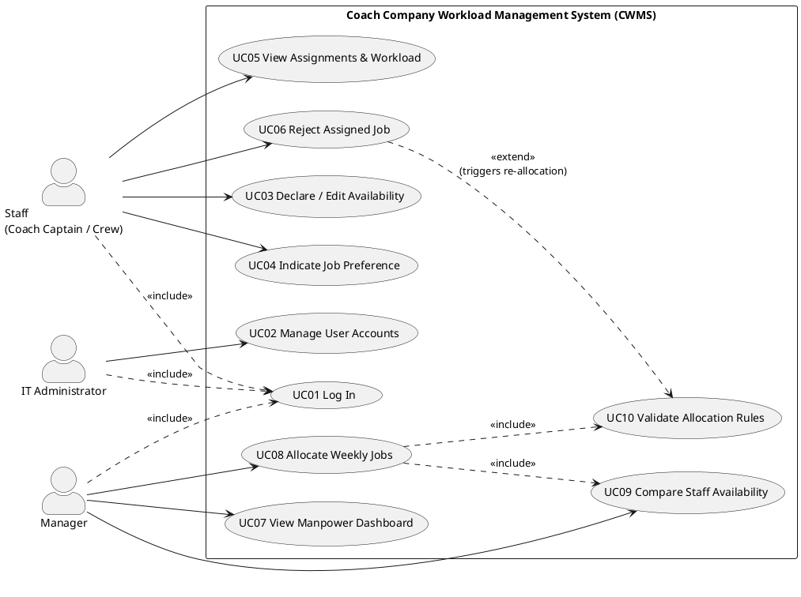
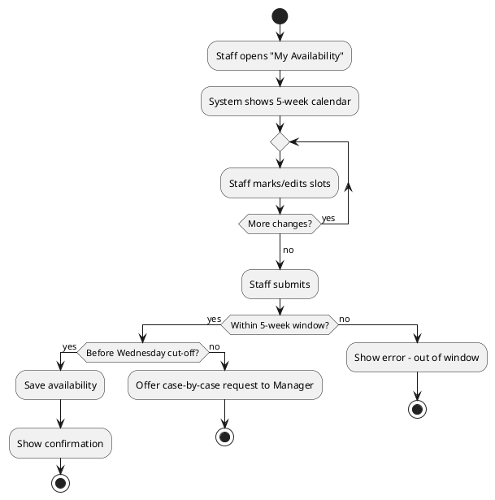
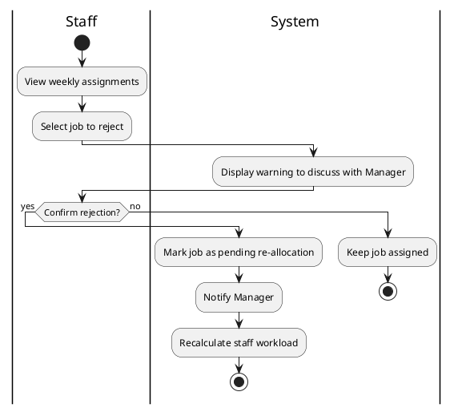
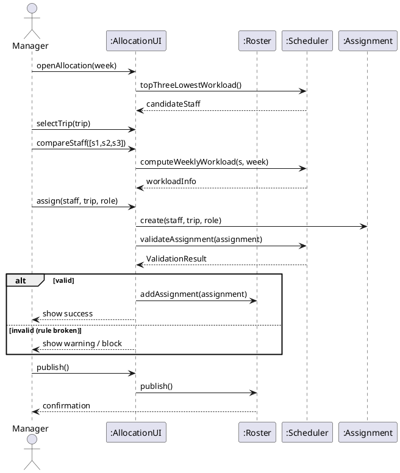
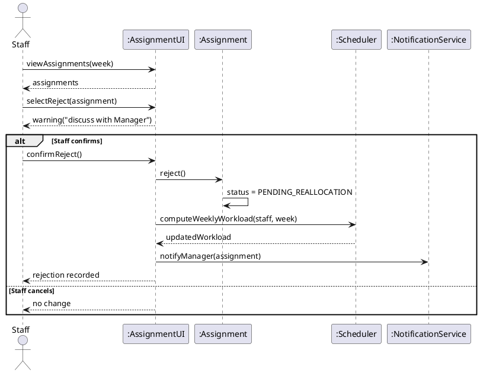
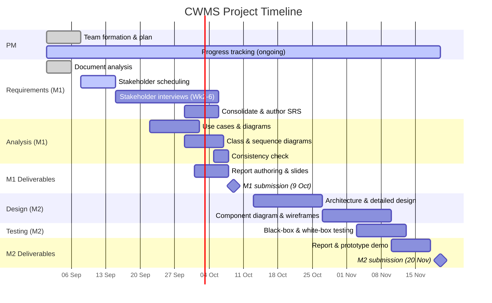

<!--
============================================================================
  INF2001 MILESTONE 1 — REFERENCE REPORT
  Coach Company Workload Management System
============================================================================

  HOW TO USE THIS DOCUMENT
  ------------------------------------------------------------------------
  This is a REFERENCE report to show you the correct structure, depth, and
  tone expected for an A-grade Milestone 1 submission. It is NOT a
  ready-to-submit document. You MUST:

    1. Replace every  🔴 [FILL IN: ...]  marker with your real data.
    2. Replace every  🟠 [VERIFY WITH STAKEHOLDER: ...]  marker after your
       actual interviews — the values here are reasonable ASSUMPTIONS, not
       confirmed facts. Your real interviews may change them.
    3. Render the PlantUML / Mermaid diagrams (see notes at each diagram)
       and paste the rendered images into your final Word/PDF report.
    4. Read, understand, and be able to DEFEND every artifact — random
       members are quizzed during the presentation.
    5. Complete the AI-usage declaration honestly.

  Search this file for "🔴" and "🟠" to find everything you must edit.
============================================================================
-->

# INF2001 Introduction to Software Engineering
# Milestone 1 Report

## Coach Company — Workload Management System

---

<!-- ======================= COVER PAGE ======================= -->

<div align="center">

**Singapore Institute of Technology**

**INF2001 — Introduction to Software Engineering**

**Team Project — Milestone 1 Report**

---

**Project Title:** Coach Company Workload Management System (CWMS)

**Team Name:** 🔴 [FILL IN: your team/group name, e.g. P1-1]

**Submission Date:** 🔴 [FILL IN: submission date — deadline is 9 Oct 2026]

**Trimester / AY:** 🔴 [FILL IN]

</div>

---

## Table of Contents

1. [Introduction](#1-introduction)
   - 1.1 [Team Members and Contributions](#11-team-members-and-contributions)
   - 1.2 [Plagiarism Declaration](#12-plagiarism-declaration)
   - 1.3 [AI Usage Declaration](#13-ai-usage-declaration)
   - 1.4 [Project Overview](#14-project-overview)
2. [Requirement Engineering](#2-requirement-engineering)
   - 2.1 [Requirement Elicitation Process](#21-requirement-elicitation-process)
   - 2.2 [Software Requirement Specification](#22-software-requirement-specification)
3. [Use Cases](#3-use-cases)
   - 3.1 [Use Case Diagram](#31-use-case-diagram)
   - 3.2 [Formal Use Cases](#32-formal-use-cases)
   - 3.3 [Activity Diagrams](#33-activity-diagrams)
4. [Object-Oriented Analysis](#4-object-oriented-analysis)
   - 4.1 [Class Diagram](#41-class-diagram)
   - 4.2 [Sequence Diagrams](#42-sequence-diagrams)
5. [Project Management](#5-project-management)
   - 5.1 [Work Breakdown Structure](#51-work-breakdown-structure)
   - 5.2 [Project Timeline](#52-project-timeline)
6. [Appendices](#6-appendices)
   - Appendix A: [Stakeholder Interview Guide](#appendix-a-stakeholder-interview-guide)
   - Appendix B: [Stakeholder Engagement Log](#appendix-b-stakeholder-engagement-log)

---

# 1. Introduction

## 1.1 Team Members and Contributions

> 🔴 **[FILL IN]** — List every member, their role, and a concrete summary of their
> contribution to Milestone 1. The rubric and peer evaluation both depend on this.
> Keep contributions specific (name the artifacts each person produced).

| # | Name | Student ID | Role | Contribution to Milestone 1 |
|---|------|-----------|------|------------------------------|
| 1 | 🔴 [Name] | 🔴 [ID] | Team Lead / Requirements | 🔴 [e.g. Led stakeholder interviews, authored SRS §2.2] |
| 2 | 🔴 [Name] | 🔴 [ID] | UML / Modelling | 🔴 [e.g. Use case & activity diagrams] |
| 3 | 🔴 [Name] | 🔴 [ID] | OO Analysis | 🔴 [e.g. Class & sequence diagrams] |
| 4 | 🔴 [Name] | 🔴 [ID] | Project Management | 🔴 [e.g. WBS, timeline, report editor] |
| 5 | 🔴 [Name] | 🔴 [ID] | Documentation / QA | 🔴 [e.g. Consistency review, formatting] |

## 1.2 Plagiarism Declaration

> This is the exact wording required by the module. Fill in the group name, members, and date.

We hereby declare that:

- We fully understand and agree to the abovementioned policy.
- We did not copy any materials from others or from other places.
- We did not share our materials with others or upload to any other places for public access.
- We agree that we will not disclose any information or material of the team project to others or upload to any other places for public access.
- We agree that our project will receive Zero mark if any misalignment with the abovementioned policies is detected.

**Declared by (Group Name):** 🔴 [FILL IN]

**Team members:**
1. 🔴 [Name]
2. 🔴 [Name]
3. 🔴 [Name]
4. 🔴 [Name]
5. 🔴 [Name]

**Date:** 🔴 [FILL IN — date of submission]

## 1.3 AI Usage Declaration

> The module requires this section. Below is a **template you must edit to reflect what
> your team actually did.** Do not submit it as-is. Be honest and specific — you will be
> asked to elaborate during the presentation.

**(i) How and where AI tools were used**

🔴 [FILL IN / EDIT] — Example wording to adapt:
> Our team used an AI assistant to help scaffold the structure of this report, to
> suggest an initial draft of functional/non-functional requirements derived from the
> project brief, and to generate first-draft UML diagrams (use case, activity, class,
> and sequence) in PlantUML notation. AI was also used to check terminology
> consistency across sections.

**(ii) What changes were made on top of the AI outputs**

🔴 [FILL IN / EDIT] — This part MUST be real. Example of the kind of thing to write:
> - We validated and revised all requirements against our stakeholder interviews (see
>   Appendix B); requirements FR-xx and NFR-xx were added/changed based on what
>   stakeholders told us.
> - We corrected the class diagram to [describe your real change], e.g. splitting the
>   `Assignment` responsibilities and adding the `RouteLeg` class after discussion.
>   [describe your real change]
> - We rewrote the elicitation narrative to reflect our actual sessions, dates, and
>   attendees.
> - [Add every other substantive change your team made.]

## 1.4 Project Overview

The Coach Company operates a fleet of **26 luxurious double-decker Scania AB coaches** across four
cross-border routes between Singapore and Malaysia. Its cabin-crew division allocates work on a
weekly cycle, and balancing staff workload is a manual, time-consuming, and error-prone task.

The **Coach Company Workload Management System (CWMS)** is a web-based application that provides an
interactive and visual way to manage cabin-crew workload. It enables **managers** to visualise
manpower availability and allocate weekly jobs, **staff** to declare availability and job
preferences, view their assignments and monthly workload, and reject assigned jobs, and **IT
administrators** to manage user accounts. The system's goal is to make workload transparent,
support fair and efficient job allocation, and improve work–life balance.

**Key domain constraints** (derived from the project brief; to be confirmed with stakeholders):

- Work allocation is planned weekly; planning starts each **Thursday**, so availability must be
  submitted by **Wednesday** to be considered. Late requests are handled case-by-case.
- Every route requires at minimum **one coach captain** (driver) and **one crew** member.
- By law, a coach captain may drive at most **2 hours continuously** and needs a **≥30-minute break**;
  routes longer than 2 hours therefore need **≥2 coach captains**.
- Coaches should not sit idle for more than 2 hours where possible (to maximise profit), and
  consecutive route assignments should chain (end point of one = start point of next).
- The system highlights staff exceeding **40 hours** of allocated work and surfaces the **3 staff with
  the lowest workload** to support balanced allocation.

---


# 2. Requirement Engineering

## 2.1 Requirement Elicitation Process

> 🟠 **[VERIFY / REPLACE WITH YOUR REAL PROCESS]** — The narrative below describes a
> *recommended* elicitation approach and reads like a completed one. You MUST rewrite it
> to reflect the techniques you actually used, with your real sessions, dates, and
> stakeholder representatives. Record real attendance in **Appendix B** — the rubric
> grades "documented process, rationale, and stakeholder involvement."

To build a shared and accurate understanding of the Coach Company's needs, our team applied a
combination of elicitation techniques rather than relying on a single source. This triangulation
reduces the risk of missing or misinterpreting requirements, especially given that the client
explicitly warned that their initial requirements may be "unclear, unreasonable and contradictory."

### 2.1.1 Techniques Used

| Technique | Purpose | Applied To | Output |
|-----------|---------|-----------|--------|
| **Document analysis** | Extract baseline requirements and domain rules | Project brief (11 initial requirements, company operating rules) | Initial requirement list; domain constraint list |
| **Stakeholder interviews** | Clarify ambiguities, confirm assumptions, elicit unstated needs | 🟠 [5 stakeholder representatives — see Appendix B] | Refined & new requirements; resolved contradictions |
| **Surveys / questionnaires** | Capture broad preferences (e.g., availability entry, workload views) | 🟠 [staff / manager respondents] | Prioritisation input; NFR expectations |
| **Prototyping walkthrough (low-fidelity)** | Validate understanding of key screens (landing, allocation) | 🟠 [manager stakeholder] | Confirmed screen content & workflow |

### 2.1.2 Process and Rationale

1. **Document analysis first.** We began by decomposing the project brief into an initial set of
   candidate functional requirements and domain rules. This gave us a baseline to interrogate.
2. **Interview preparation.** We prepared a structured interview guide (see **Appendix A**) targeting
   the ambiguities we identified — for example, what data uniquely defines a "job", how job
   rejection should re-trigger allocation, and how the "40-hour" and "top-3 lowest workload" rules
   are computed.
3. **Stakeholder interviews.** We engaged 🟠 [**N ≥ 5**] stakeholder representatives (at most two from
   our own team), playing the roles of Manager, Staff (cabin crew / coach captain), and IT
   Administrator. 🟠 [Summarise what each session confirmed or changed.]
4. **Consolidation & conflict resolution.** We reconciled contradictory inputs, recording the final
   agreed decision and its rationale (see the assumptions table in §2.2.4).
5. **Validation.** We replayed the consolidated requirements to stakeholders for confirmation before
   finalising the SRS.

> 🟠 **[VERIFY WITH STAKEHOLDER]** — Key ambiguities we resolved through interviews (replace with your
> real answers):
> - Does "workload" mean allocated hours only, or also planned break time? *(Assumed: allocated
>   driving/serving hours only.)*
> - Is the 40-hour highlight per week or per month? *(Assumed: per week.)*
> - Can staff edit availability after allocation is published? *(Assumed: no — only via manager,
>   case-by-case.)*

## 2.2 Software Requirement Specification

### 2.2.1 Actors / Users

| Actor | Description |
|-------|-------------|
| **Staff** | Cabin crew — either a *Coach Captain* (drives) or *Crew* (serves passengers, cleaning). Declares availability & preferences, views assignments/workload, rejects jobs. |
| **Manager** | Administrative staff who visualises manpower and allocates weekly jobs. |
| **IT Administrator** | Creates and manages staff and manager accounts. |
| **System (Scheduler)** | Automated logic that computes workload metrics, validates allocation rules, and raises warnings. |

### 2.2.2 Functional Requirements

> Each requirement is uniquely identified (FR-xx), traceable to a brief requirement or domain rule,
> and written to be **specific and testable**. Priority uses MoSCoW (M=Must, S=Should, C=Could).
> 🟠 Re-prioritise and add/remove based on your stakeholder interviews.

**Authentication & User Management**

| ID | Requirement | Priority | Source |
|----|-------------|----------|--------|
| FR-01 | The system shall authenticate users via credentials and route them to a role-specific landing page (Staff, Manager, IT Admin). | M | Brief #11, derived |
| FR-02 | The IT Administrator shall be able to create, edit, and deactivate Staff and Manager accounts, including assigning a role (Coach Captain / Crew / Manager). | M | Brief #11 |

**Staff — Availability & Preferences**

| ID | Requirement | Priority | Source |
|----|-------------|----------|--------|
| FR-03 | A Staff member shall be able to add and edit their availability for dates up to **5 weeks** ahead. | M | Brief #8 |
| FR-04 | The system shall prevent availability edits for a week once its allocation has been published; late changes are routed to the Manager as a case-by-case request. | S | Brief (Wed deadline), 🟠 verify |
| FR-05 | A Staff member shall be able to indicate their **job preference** for the week (e.g., preferred routes/shifts). | M | Brief #9 |
| FR-06 | The system shall record and enforce the weekly availability submission cut-off (**Wednesday**) before planning begins on Thursday. | M | Brief (company rules) |

**Staff — Assignments & Workload**

| ID | Requirement | Priority | Source |
|----|-------------|----------|--------|
| FR-07 | A Staff member shall be able to view their **weekly job assignments** on their landing page. | M | Brief #7 |
| FR-08 | A Staff member shall be able to view their **overall workload for the month** on their landing page. | M | Brief #7 |
| FR-09 | A Staff member shall be able to **reject** a job assigned to them. | M | Brief #10 |
| FR-10 | When a Staff member attempts to reject a job, the system shall display a **warning** advising them to discuss with their Manager before confirming. | M | Brief #10 |
| FR-11 | Upon a confirmed rejection, the system shall notify the Manager and flag the affected route/job as requiring re-allocation. | S | Derived, 🟠 verify |

**Manager — Visualisation & Allocation**

| ID | Requirement | Priority | Source |
|----|-------------|----------|--------|
| FR-12 | On the Manager landing page, the system shall visualise overall staff workload immediately. | M | Brief #2 |
| FR-13 | The landing page shall display the **top three staff with the lowest workload**. | M | Brief #6 |
| FR-14 | The landing page shall **highlight all staff exceeding 40 hours** of allocated work. | M | Brief #6 |
| FR-15 | The Manager shall be able to allocate jobs to staff **one week at a time**. | M | Brief #3 |
| FR-16 | On the job-allocation page, the Manager shall be able to view **up to three staff** side-by-side to compare availability and relevant information. | M | Brief #4 |
| FR-17 | For each staff shown, the system shall display: assigned workload, job preference, staff location on a given date, and weekly availability. | M | Brief #5 |
| FR-18 | The system shall validate each allocation against staffing rules: every route has ≥1 Coach Captain and ≥1 Crew; routes >2 hours have ≥2 Coach Captains. | M | Brief (company rules) |
| FR-19 | The system shall warn the Manager when an allocation would push a staff member over 40 hours. | S | Derived from #6 |
| FR-20 | The system shall support chaining assignments so a captain's next route start location matches their previous route end location, flagging violations. | C | Brief (company rules), 🟠 verify |

**System / Scheduling**

| ID | Requirement | Priority | Source |
|----|-------------|----------|--------|
| FR-21 | The system shall compute each staff member's total allocated hours for the week and month. | M | Derived (#6, #7) |
| FR-22 | The system shall enforce coach-captain driving limits (≤2h continuous, ≥30 min break) when validating assignments. | M | Brief (company rules) |
| FR-23 | The system shall maintain the route catalogue and schedule (4 routes with their frequencies). | S | Brief (company rules) |

### 2.2.3 Non-Functional Requirements

> Written to be **measurable and justified**. 🟠 Confirm target numbers with stakeholders — the
> values below are reasonable defaults, not confirmed SLAs.

| ID | Category | Requirement | Rationale |
|----|----------|-------------|-----------|
| NFR-01 | Performance | The landing page workload visualisation shall load within **3 seconds** for up to 100 staff. | Managers rely on it "immediately" (Brief #2). |
| NFR-02 | Performance | Job allocation actions (assign/validate) shall respond within **2 seconds**. | Keeps weekly planning efficient. |
| NFR-03 | Usability | A new Manager shall be able to complete a weekly allocation after a **single ≤15-min training session**. | System is meant to *ease* workload management. |
| NFR-04 | Usability | Workload and availability shall be viewable "at a glance" using **colour-coded visual indicators** (e.g., red for >40h). | Brief emphasises visual, at-a-glance views. |
| NFR-05 | Security | Passwords shall be stored hashed+salted; sessions shall time out after **30 minutes** of inactivity. | Protects employee personal data. |
| NFR-06 | Security / Access | The system shall enforce **role-based access control** (Staff, Manager, IT Admin). | Prevents unauthorised allocation/account changes. |
| NFR-07 | Reliability | The system shall be available **≥99%** during business hours (🟠 define hours). | Weekly deadlines are time-critical. |
| NFR-08 | Compatibility | The web app shall work on the latest two versions of Chrome, Edge, and Safari, on desktop and tablet. | Managers/staff use varied devices. |
| NFR-09 | Maintainability | Code shall follow a documented style guide and layered architecture to support future changes. | Client anticipates evolving requirements. |
| NFR-10 | Data | Availability and assignment history shall be retained for at least **12 months** for auditing. | Supports case-by-case dispute handling. |

### 2.2.4 Assumptions and Resolved Contradictions

> 🟠 **[VERIFY WITH STAKEHOLDER]** — These are the assumptions we made where the brief was silent or
> contradictory. Replace/confirm each with the answer your stakeholders actually gave.

| # | Ambiguity / Contradiction | Assumption / Resolution | To Confirm |
|---|---------------------------|--------------------------|-----------|
| A1 | "Workload" units | Measured in **hours** of assigned driving/serving time. | 🟠 |
| A2 | 40-hour threshold period | Evaluated **per week**. | 🟠 |
| A3 | Availability window mismatch (brief says "one month" in prose but "5 weeks" in requirement #8) | Use **5 weeks** (the explicit requirement takes precedence). | 🟠 |
| A4 | Editing availability after publish | **Not allowed**; handled by Manager case-by-case. | 🟠 |
| A5 | Effect of job rejection | Frees the slot and flags the route for **re-allocation**; Manager notified. | 🟠 |

---


# 3. Use Cases

> **How to render the diagrams:** the diagrams below are written in **PlantUML**. Paste each block
> into [planttext.com](https://www.planttext.com) or the PlantUML VS Code extension, export as PNG,
> and place the image into your final Word/PDF report with a numbered caption
> (e.g., *Figure 3.1 — CWMS Use Case Diagram*).

## 3.1 Use Case Diagram



*Figure 3.1 — CWMS Use Case Diagram.* Traceability: UC03→FR-03/FR-05, UC05→FR-07/FR-08,
UC06→FR-09/FR-10/FR-11, UC07→FR-12/FR-13/FR-14, UC08→FR-15/FR-16/FR-17, UC10→FR-18/FR-22.

## 3.2 Formal Use Cases

> Below are the fully-specified use cases. For brevity in this reference, three high-value use cases
> are written in full formal detail (UC03, UC06, UC08). 🟠 Expand UC01, UC02, UC04, UC05, UC07, UC09,
> UC10 to the same level of detail for your submission — the rubric wants "all major use cases
> formalized."

### UC03 — Declare / Edit Availability

| Field | Description |
|-------|-------------|
| **Use Case ID** | UC03 |
| **Name** | Declare / Edit Availability |
| **Actor(s)** | Staff (primary) |
| **Related Requirements** | FR-03, FR-04, FR-06 |
| **Description** | Staff indicate the dates/times they are available to work, up to 5 weeks ahead. |
| **Preconditions** | Staff is logged in (UC01). The target week's allocation has not yet been published. |
| **Postconditions** | Availability records are saved and visible to the Manager during allocation. |
| **Main Flow** | 1. Staff selects "My Availability". 2. System displays a calendar for the next 5 weeks. 3. Staff marks/edits available and unavailable slots. 4. Staff submits. 5. System validates the date is within the 5-week window and before the Wednesday cut-off. 6. System saves and confirms. |
| **Alternative Flows** | **3a.** Staff sets a preferred location per date → recorded for FR-17. **5a.** Date is past the Wednesday cut-off → system rejects the edit and offers to send a case-by-case request to the Manager (FR-04). |
| **Exceptions** | **E1.** Selected date is beyond the 5-week window → system shows an error and blocks the entry. |

### UC06 — Reject Assigned Job

| Field | Description |
|-------|-------------|
| **Use Case ID** | UC06 |
| **Name** | Reject Assigned Job |
| **Actor(s)** | Staff (primary), Manager (secondary/notified) |
| **Related Requirements** | FR-09, FR-10, FR-11 |
| **Description** | Staff rejects a job they cannot fulfil; system warns them and, if confirmed, flags it for re-allocation. |
| **Preconditions** | Staff is logged in; at least one job is assigned to the Staff member. |
| **Postconditions** | The job is marked "rejected/pending re-allocation"; Manager is notified. |
| **Main Flow** | 1. Staff opens weekly assignments (UC05). 2. Staff selects a job and chooses "Reject". 3. System displays a **warning** advising discussion with the Manager (FR-10). 4. Staff confirms rejection. 5. System marks the job for re-allocation and notifies the Manager (FR-11). 6. System updates the Staff member's workload total. |
| **Alternative Flows** | **4a.** Staff cancels at the warning → no change is made. |
| **Exceptions** | **E1.** The week is locked/finalised → rejection routed as a case-by-case request instead. |

### UC08 — Allocate Weekly Jobs

| Field | Description |
|-------|-------------|
| **Use Case ID** | UC08 |
| **Name** | Allocate Weekly Jobs |
| **Actor(s)** | Manager (primary), System/Scheduler (secondary) |
| **Related Requirements** | FR-15, FR-16, FR-17, FR-18, FR-19, FR-22 |
| **Description** | Manager assigns staff to routes for one week, aided by availability comparison and rule validation. |
| **Preconditions** | Manager is logged in; the availability cut-off (Wednesday) has passed; staff availability exists for the week. |
| **Postconditions** | A valid weekly roster is saved and published; staff can view their assignments (UC05). |
| **Main Flow** | 1. Manager opens the allocation page for a chosen week. 2. Manager selects a route/trip to staff. 3. Manager compares up to three candidate staff (UC09) — showing workload, preference, location, availability (FR-17). 4. Manager assigns a Coach Captain and Crew. 5. System validates staffing rules (UC10 / FR-18, FR-22). 6. Manager repeats for all trips. 7. Manager publishes the roster. |
| **Alternative Flows** | **5a.** Route >2h has only one captain → system blocks and prompts for a second captain (FR-18). **5b.** Assignment pushes a staff member over 40h → system warns but allows override (FR-19). |
| **Exceptions** | **E1.** No available staff for a required role → trip flagged "unstaffed"; Manager resolves case-by-case. |

## 3.3 Activity Diagrams

> The rubric asks for activity diagrams for key processes (e.g., availability submission,
> allocation, notification/rejection). Two are provided; 🟠 add one for UC08 (allocation) too.

### 3.3.1 Activity Diagram — Declare / Edit Availability (UC03)


*Figure 3.2 — Activity Diagram: Declare / Edit Availability.*

### 3.3.2 Activity Diagram — Reject Assigned Job (UC06)


*Figure 3.3 — Activity Diagram: Reject Assigned Job.*

---


# 4. Object-Oriented Analysis

## 4.1 Class Diagram

The class model was derived by noun-analysis of the SRS and use cases. Key entities: **User** (with
subtypes **Staff**, **Manager**, **ITAdministrator**), **CoachCaptain**/**Crew** as specialisations
of Staff, **Availability**, **JobPreference**, **Route**, **Trip**, **Assignment**, **Roster**, and a
**Scheduler** service that computes workload and validates rules.

```plantuml
@startuml
skinparam classAttributeIconSize 0

abstract class User {
  - userId : String
  - name : String
  - email : String
  - passwordHash : String
  + login() : boolean
  + logout() : void
}

class Staff {
  - staffId : String
  - role : StaffRole
  + addAvailability(a : Availability) : void
  + editAvailability(a : Availability) : void
  + setPreference(p : JobPreference) : void
  + viewAssignments(week : Week) : List<Assignment>
  + viewMonthlyWorkload(month : Month) : double
  + rejectJob(a : Assignment) : void
}

class CoachCaptain {
  - licenceNo : String
  + maxContinuousDriveHours() : int
}

class Crew {
  - serviceGrade : String
}

class Manager {
  + viewDashboard() : ManpowerDashboard
  + allocateJobs(week : Week) : Roster
  + compareStaff(staff : List<Staff>) : void
}

class ITAdministrator {
  + createUser(u : User) : void
  + editUser(u : User) : void
  + deactivateUser(u : User) : void
}

class Availability {
  - availabilityId : String
  - date : Date
  - startTime : Time
  - endTime : Time
  - preferredLocation : String
  - status : AvailabilityStatus
}

class JobPreference {
  - preferenceId : String
  - week : Week
  - preferredRoutes : List<Route>
  - preferredShift : String
}

class Route {
  - routeId : String
  - origin : String
  - destination : String
  - durationHours : double
  - frequencyPerDay : int
  + requiresTwoCaptains() : boolean
}

class Trip {
  - tripId : String
  - departureDateTime : DateTime
  - direction : String
}

class Assignment {
  - assignmentId : String
  - roleOnTrip : StaffRole
  - status : AssignmentStatus
  - allocatedHours : double
  + reject() : void
  + confirm() : void
}

class Roster {
  - rosterId : String
  - week : Week
  - published : boolean
  + addAssignment(a : Assignment) : void
  + publish() : void
}

class Scheduler {
  + computeWeeklyWorkload(s : Staff, w : Week) : double
  + computeMonthlyWorkload(s : Staff, m : Month) : double
  + topThreeLowestWorkload() : List<Staff>
  + staffOver40Hours() : List<Staff>
  + validateAssignment(a : Assignment) : ValidationResult
}

enum StaffRole { COACH_CAPTAIN CREW }
enum AvailabilityStatus { AVAILABLE UNAVAILABLE }
enum AssignmentStatus { PROPOSED CONFIRMED REJECTED PENDING_REALLOCATION }

User <|-- Staff
User <|-- Manager
User <|-- ITAdministrator
Staff <|-- CoachCaptain
Staff <|-- Crew

Staff "1" --> "0..*" Availability : declares
Staff "1" --> "0..*" JobPreference : sets
Staff "1" --> "0..*" Assignment : is assigned
Manager "1" --> "0..*" Roster : creates
Roster "1" *-- "0..*" Assignment : contains
Assignment "0..*" --> "1" Trip : for
Trip "0..*" --> "1" Route : follows
Manager ..> Scheduler : uses
Scheduler ..> Assignment : validates
@enduml
```
*Figure 4.1 — CWMS Domain Class Diagram.*

**Relationship rationale**

- **Inheritance:** `Staff`, `Manager`, `ITAdministrator` share identity/login behaviour → generalised
  into `User`. `CoachCaptain` and `Crew` specialise `Staff` because they differ in role-specific
  rules (e.g., captains have driving limits).
- **Composition:** a `Roster` *owns* its `Assignment`s (deleting a roster removes its assignments).
- **Association:** `Staff`–`Availability`, `Staff`–`Assignment`, `Trip`–`Route`, etc.
- **Dependency:** `Manager` and validation logic *use* the `Scheduler` service without owning it.

> 🟠 Refine multiplicities/attributes after interviews (e.g., whether a Trip can span multiple Routes,
> or whether break periods are modelled explicitly).

## 4.2 Sequence Diagrams

> Sequence diagrams below cover the same high-value use cases (UC08 allocation, UC06 rejection).
> 🟠 Add sequence diagrams for UC03 (availability) and UC07 (dashboard) to fully satisfy the rubric.

### 4.2.1 Sequence Diagram — Allocate Weekly Jobs (UC08)


*Figure 4.2 — Sequence Diagram: Allocate Weekly Jobs.*

### 4.2.2 Sequence Diagram — Reject Assigned Job (UC06)


*Figure 4.3 — Sequence Diagram: Reject Assigned Job.*

---


# 5. Project Management

## 5.1 Work Breakdown Structure

The WBS decomposes the project into phases → tasks → subtasks using a hierarchical numbering scheme
(1, 1.1, 1.1.1). It covers the full lifecycle: requirements, design, implementation, testing,
documentation, and project management.

```
1  Project Management
   1.1  Team formation & role assignment
   1.2  Project plan, WBS & timeline
   1.3  Progress tracking & weekly stand-ups
   1.4  Peer evaluation & submission packaging

2  Requirements Engineering
   2.1  Document analysis of project brief
   2.2  Stakeholder identification & scheduling (≥5 reps)
   2.3  Interview guide & survey design
   2.4  Conduct stakeholder engagements (Weeks 2–6)
        2.4.1  Manager interviews
        2.4.2  Staff (captain/crew) interviews
        2.4.3  IT Administrator interview
   2.5  Consolidate & resolve contradictions
   2.6  Author SRS (functional & non-functional)

3  Analysis & Modelling
   3.1  Use case identification
   3.2  Formal use case specifications
   3.3  Use case diagram
   3.4  Activity diagrams
   3.5  Class identification & class diagram
   3.6  Sequence diagrams
   3.7  Traceability & consistency check

4  Design (Milestone 2)
   4.1  Architectural pattern selection
   4.2  Detailed design & design pattern
   4.3  Component diagram
   4.4  Wireframes / prototype

5  Testing (Milestone 2)
   5.1  Black-box (decision table) testing
   5.2  White-box (CFG & cyclomatic complexity) testing

6  Documentation & Presentation
   6.1  Milestone 1 report authoring & formatting
   6.2  Milestone 1 presentation slides
   6.3  Milestone 2 report & prototype demo
   6.4  Final review & submission (zip: INF2001-M1-🔴[TeamX].zip)
```

*Table/Figure 5.1 — Work Breakdown Structure.* 🟠 Assign an owner and effort estimate to each leaf
task (add columns: Owner, Est. hours) — this strengthens the PM section and supports peer evaluation.

## 5.2 Project Timeline

The timeline maps WBS tasks to the trimester weeks, with Milestone 1 due **9 Oct 2026** (Week 6) and
Milestone 2 due **20 Nov 2026** (Week 12). Note the hard constraint: **stakeholder engagement can
only run Weeks 2–6.**

> Render this Gantt chart in Mermaid (GitHub/mermaid.live render it directly) and export for the
> report. 🔴 Replace the placeholder calendar dates with your trimester's actual week dates.


*Figure 5.2 — Project Timeline (Gantt).* Dependencies: SRS (r4) depends on interviews (r3);
analysis (a1, a2) depends on the SRS; M1 report (m1) depends on analysis completion.

---


# 6. Appendices

## Appendix A: Stakeholder Interview Guide

> Use these questions in your real interviews. They are designed to resolve the ambiguities that
> feed directly into the flagged (🟠) items above. Record answers and cite them in §2.1 and §2.2.4.

**General / all stakeholders**
1. In one sentence, what does a successful workload system look like to you?
2. What is the single most painful part of the current (manual) allocation process?

**Manager**
3. When you open the dashboard, what must you see *first*? What does "at a glance" mean to you?
4. How exactly is "workload" measured — driving hours, total on-duty hours, or number of trips?
5. Is the 40-hour highlight a weekly or monthly threshold? What should happen at 40h — block or warn?
6. When comparing up to 3 staff, which fields matter most for your decision?
7. How should a rejected job re-enter the allocation process?
8. Should the system auto-suggest allocations, or only validate your manual choices?

**Staff (Coach Captain / Crew)**
9. How far ahead do you realistically know your availability? (Brief says 5 weeks — accurate?)
10. After the Wednesday cut-off, how are last-minute changes handled today?
11. What information about a job do you need before deciding to accept or reject?
12. What does "job preference" mean to you — routes, shifts, partners, or something else?

**IT Administrator**
13. What details are captured when onboarding a new staff member or manager?
14. Are there existing systems/data the new system must integrate with or import from?
15. What are your security and access-control expectations?

**Non-functional probes (all)**
16. How many staff/managers will use the system? Expected peak concurrent users?
17. What devices/browsers will be used most?
18. What are acceptable response times and downtime windows?

## Appendix B: Stakeholder Engagement Log

> 🔴 **[FILL IN — REQUIRED]** The overview mandates ≥5 stakeholder representatives (max 2 from your own
> team), engaged between Week 2 and Week 6, with attendance recorded. This table is graded evidence.

| # | Date | Stakeholder (role played) | Own team? | Technique | Duration | Attendees (your team) | Key outcomes |
|---|------|---------------------------|-----------|-----------|----------|------------------------|--------------|
| 1 | 🔴 | 🔴 Manager | 🔴 Y/N | Interview | 🔴 | 🔴 | 🔴 |
| 2 | 🔴 | 🔴 Coach Captain | 🔴 Y/N | Interview | 🔴 | 🔴 | 🔴 |
| 3 | 🔴 | 🔴 Crew | 🔴 Y/N | Interview | 🔴 | 🔴 | 🔴 |
| 4 | 🔴 | 🔴 IT Administrator | 🔴 Y/N | Interview | 🔴 | 🔴 | 🔴 |
| 5 | 🔴 | 🔴 [role] | 🔴 Y/N | Survey | 🔴 | 🔴 | 🔴 |

---

## References

> 🟠 Add any sources you cite (IEEE/APA style). Two from the brief are pre-filled.

1. Guest, D. E. (2002) 'Perspectives on the Study of Work-life Balance', *Social Science Information*, 41(2), pp. 255–279. doi:10.1177/0539018402041002005.
2. Lupu, I. and Ruiz-Castro, M. (2021) "Work-Life Balance Is a Cycle, Not an Achievement", *Harvard Business Review*.
3. 🔴 [Add UML / software engineering references you used, e.g., a UML textbook or the module notes.]

---

<!--
============================================================================
  FINAL CHECKLIST BEFORE SUBMISSION (delete this block in your final report)
============================================================================
  [ ] Replace ALL 🔴 markers (team name, members, dates, engagement log).
  [ ] Confirm/replace ALL 🟠 markers with real stakeholder answers.
  [ ] Render all PlantUML + Mermaid diagrams to images and embed them.
  [ ] Expand remaining formal use cases (UC01,02,04,05,07,09,10) to full detail.
  [ ] Add sequence diagrams for UC03 and UC07.
  [ ] Add Owner + effort columns to WBS leaf tasks.
  [ ] Write the REAL AI-usage declaration (§1.3) describing what YOU changed.
  [ ] Convert to Word/PDF using the module's required template.
  [ ] Consistency pass: FR-xx ↔ UC ↔ diagrams ↔ classes use identical names.
  [ ] Build slides covering each chapter's key deliverables.
  [ ] Everyone can explain any random part (presentation Q&A).
  [ ] Zip as INF2001-M1-[TeamX].zip and submit before 11:59PM 9 Oct 2026.
  [ ] Complete peer evaluation.
============================================================================
-->
