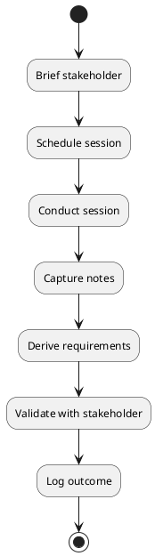
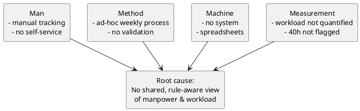
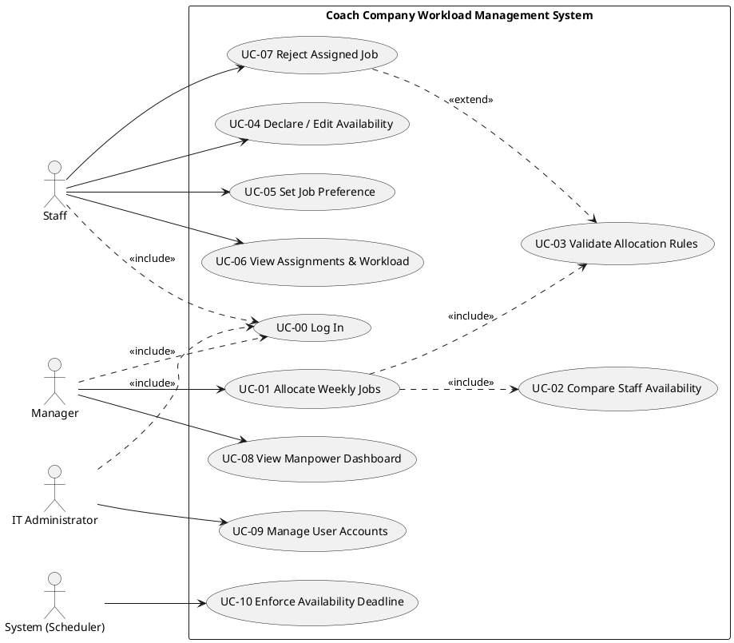
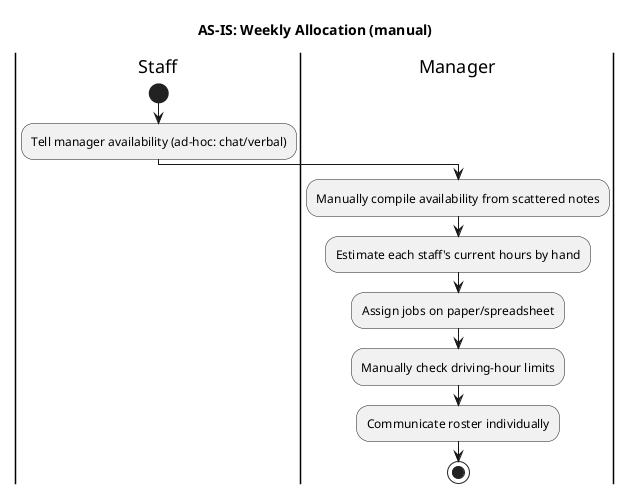
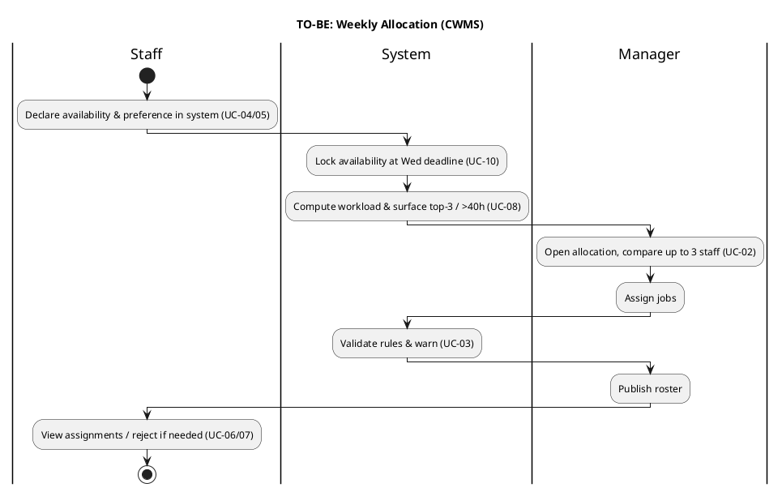
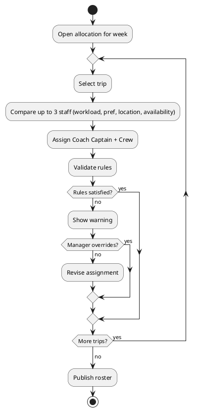
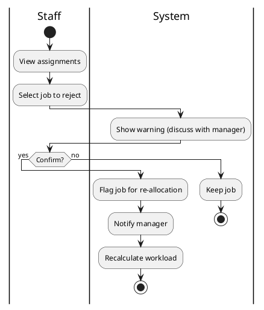
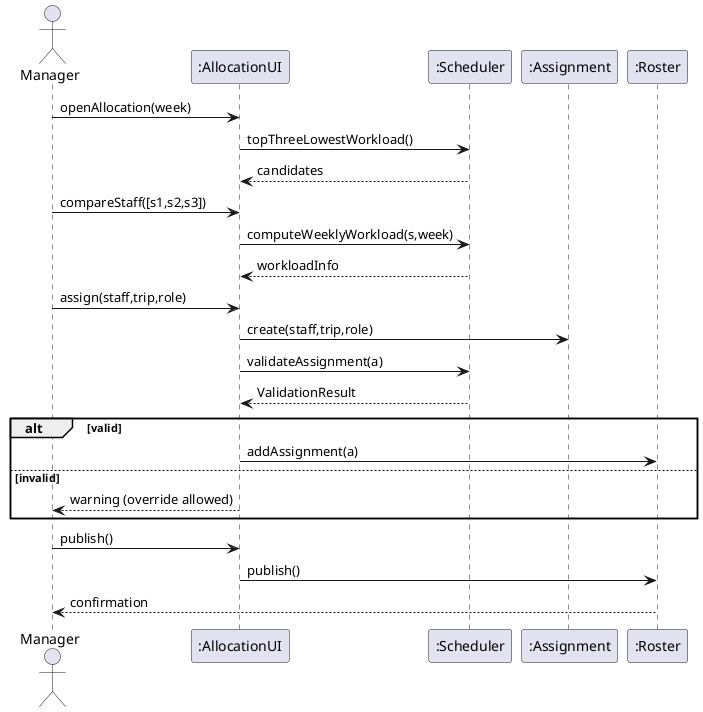
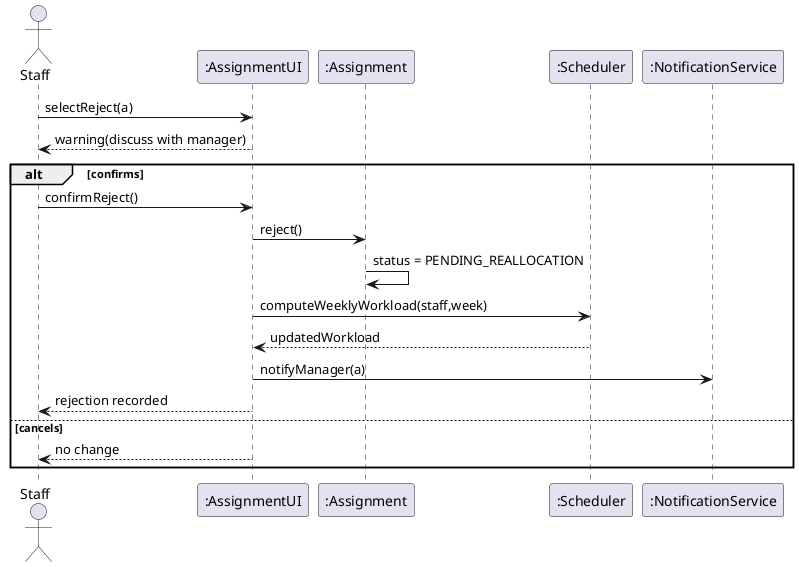
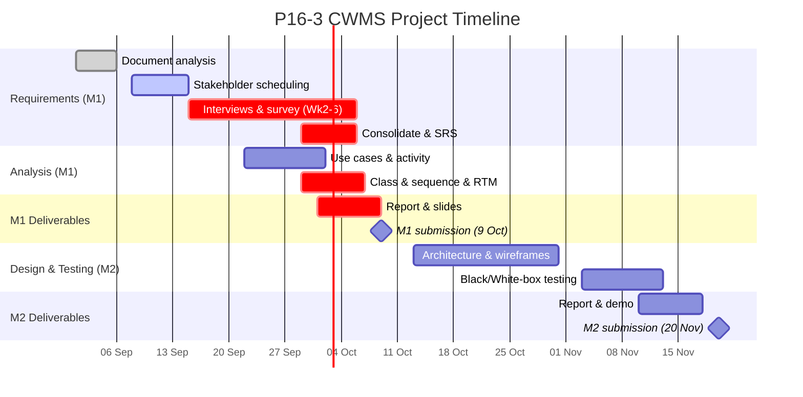

<!--
============================================================================
  P16-3 — INF2001 MILESTONE 1 REPORT (FILLED FROM YOUR GROUP'S TEMPLATE)
============================================================================
  LEGEND used throughout this document:
    🟢 WRITTEN FOR YOU  — derivable from the project brief + standard SE
       analysis. Read, sanity-check, and adjust wording to your voice.
    🔴 NEEDS REAL PEOPLE — must come from YOUR actual interviews/surveys.
       Cannot be invented (academic integrity + assessor will quiz you).
       I provide the table/structure + the questions to ask.
    🟠 TEAM DECISION    — a design choice your team must confirm; I give a
       recommended default and the consequences of each option.
============================================================================
-->

# INF2001 Introduction to Software Engineering
# Milestone 1 Report

**Team:** P16-3  **Group:** P16-3  **Date:** October 2026
**Assessor:** Francis Mahendran

---

## AI USAGE DECLARATION

> 🔴 **NEEDS YOUR REAL INPUT** — must honestly describe what your team did. Draft below to EDIT.

**(i) How and where AI tools were used.**
🟠 [EDIT to match reality] Our team used an AI assistant to help structure this report against
our agreed outline, to produce first drafts of brief-derivable analysis (candidate functional and
non-functional requirements, business rules, use-case skeletons, the analysis-level class model, the
WBS, and the risk register), and to draft UML diagrams in PlantUML notation. AI was also used as a
consistency checker across chapters.

**(ii) What was changed on the AI output.**
🔴 [MUST be real — list your actual edits] For example:
- All interview-derived content (§2.1.4, §2.1.5, findings, survey results) was written by us from our
  own stakeholder sessions; AI did not generate these.
- We revised requirements FR-__ and NFR-__ after our interviews contradicted the initial draft.
- We changed the class model by [your real change], and re-scoped AC-04 after TEAM DECISION 2.
- We rewrote [sections] in our own words and corrected [specific items].

---

## PLAGIARISM DECLARATION

We hereby pledge that this Problem Statement task is not plagiarized and has been written wholly as a
result of our own research and compilation of information.

**Team: P16-3**

| # | Student Name | Student ID | Signature |
|---|--------------|-----------|-----------|
| 1 | HANG NIAN KHYE JORDEN | 2501009 | Jorden |
| 2 | MARCUS AW KAR MING | 2501243 | Marcus |
| 3 | MALLARI ALBERTO III CUYO | 2501920 | Alberto |
| 4 | MELVYN FOO JIE HUI | 2500871 | Melvyn |
| 5 | NUR HANNAH BINTE NORDIN POH | 2502000 | Hannah |
| 6 | SHAHIRAH AQILAH BINTE SAMSURI | 2501761 | Shahirah |

**Date:** October 2026

> 🔴 Insert real handwritten/e-signatures and the exact submission date before submitting.

---

## GLOSSARY AND ABBREVIATIONS (core terms)

| Term | Meaning |
|------|---------|
| CWMS | Coach Company Workload Management System — the system being specified |
| Coach Captain | Cabin-crew member who drives the coach (subject to legal driving-hour limits) |
| Crew | Cabin-crew member who serves passengers and maintains the coach |
| Roster | The set of job assignments published for one week |
| Availability | A staff member's declared willingness/ability to work on given dates |
| Workload | Total assigned working hours for a staff member over a period |
| FR / NFR | Functional / Non-Functional Requirement |
| BR | Business Rule |
| RTM | Requirements Traceability Matrix |
| DMAIC | Define-Measure-Analyse-Improve-Control (Lean Six Sigma framing) |

> Full list → Appendix I.

---

## EXECUTIVE SUMMARY

🟢 The Coach Company allocates cabin-crew work manually on a weekly cycle across 26 double-decker
coaches and four Singapore–Malaysia routes. The current process gives managers no consolidated,
at-a-glance view of manpower, makes balancing workload error-prone, and offers staff no structured
way to declare availability or preferences. This milestone specifies the **Coach Company Workload
Management System (CWMS)**, a web application that makes workload visible, supports rule-compliant
weekly allocation, and lets staff manage their own availability, preferences, assignments, and job
rejections.

This report documents our requirement engineering (elicitation approach, an SRS of functional and
non-functional requirements, business rules, and security mapping), an object-oriented analysis (use
cases, activity diagrams, an analysis class model, sequence diagrams, and a traceability matrix), and
our project management plan (WBS, timeline, RACI, risk, and quality). Design decisions are recorded
as lightweight ADRs, and a key architectural choice — validate-and-warn rather than hard-block, with
a manual-review escape hatch — is named as a reusable pattern carried into Milestone 2.

> 🔴 Add one sentence summarising the headline finding from your interviews once conducted.

---


# 1  INTRODUCTION

## 1.1  Project Background and Problem Statement

🟢 Balancing cabin-crew workload is a recurring operational challenge for the Coach Company. Work is
allocated weekly, with planning beginning each Thursday, so every staff member's availability must be
recorded by the preceding Wednesday. Today this is done manually: the manager has no single,
up-to-date view of who is available, how many hours each person is already carrying, or where each
staff member will be on a given date. The result is a process that is slow, opaque, and prone to
uneven workloads — some staff are over-allocated (beyond 40 hours) while others are under-used, and
legal driving-hour rules must be tracked by hand.

Framed in cost terms, the current process consumes disproportionate managerial time each week,
increases the risk of allocation errors that must be unwound, and erodes staff work–life balance
(a documented driver of turnover and disengagement). CWMS targets these costs directly by making
manpower and workload visible and by validating allocations against the company's rules automatically.

### 1.1.1  Current-Process Pain Points and Waste Mapping

🟢 Waste is categorised using the Lean **DOWNTIME** taxonomy (Defects, Overproduction, Waiting,
Non-utilised talent, Transportation, Inventory, Motion, Extra-processing).

| Pain point (current process) | Waste category (DOWNTIME) | Affected stakeholder |
|------------------------------|---------------------------|----------------------|
| Manager manually compiles availability from scattered sources | Motion / Extra-processing | Manager |
| No at-a-glance workload view; over/under-allocation goes unnoticed | Defects (uneven allocation) | Manager, Staff |
| Legal driving-hour limits tracked by hand | Defects (compliance risk) | Coach Captain, Manager |
| Staff cannot see assignments/workload without asking | Waiting | Staff |
| Under-used staff not surfaced while others exceed 40h | Non-utilised talent | Staff, Business Owner |
| Late availability changes handled ad-hoc each week | Extra-processing | Manager |

*Table 1.1 — Pain points mapped to waste categories.*

## 1.2  Project Objectives and Scope

🟢 **Objectives** (each traced to requirements in §2.2 and the RTM in §4.6):

- **O1** Give managers an immediate, visual view of manpower and workload on the landing page.
- **O2** Support weekly job allocation that is validated against the company's staffing and legal rules.
- **O3** Let staff declare and edit availability up to 5 weeks ahead and indicate weekly job preferences.
- **O4** Let staff view their weekly assignments and monthly workload, and reject assigned jobs with a warning.
- **O5** Surface workload imbalance (top-3 lowest workload; highlight staff over 40 hours).
- **O6** Provide IT administrators with account management for staff and managers.

**Scope**

| In scope | Out of scope |
|----------|--------------|
| Web application for Manager, Staff, IT Admin | Native mobile apps |
| Weekly allocation, availability, preferences, rejection | Payroll / HR integration |
| Rule validation (min crew, 2h limit, break, >40h flag) | Automated optimal-solver allocation (see §2.3.1) |
| Account management by IT Admin | Passenger-facing features |
| Standalone system, no external integrations | Data migration from legacy systems |

*Table 1.2 — In-scope / out-of-scope.*

### 1.2.1  Problem → Objective Traceability Map

🟢 The objectives are facets of one root cause — *lack of a shared, rule-aware view of manpower* —
not independent fixes.

| Pain point (1.1.1) | Objective(s) that resolve it | Addressed in |
|--------------------|------------------------------|--------------|
| Manual availability compilation | O1, O3 | §2.2.2, §3.4 (UC-05) |
| No at-a-glance workload view | O1, O5 | §2.2.2 (FR dashboard), §3.4 (UC-07) |
| Driving-hour limits tracked by hand | O2 | §2.2.5 (BR-02/03), §3.6 |
| Staff cannot see assignments | O4 | §3.4 (UC-06) |
| Under-used vs over-allocated staff | O5 | §2.2.5 (BR-08), §2.2.2 |
| Ad-hoc late changes | O2, O3 | §2.2.5 (BR-07), §2.3 |

*Table 1.3 — Problem → objective traceability.*

## 1.3  Stakeholders (Overview)

🟢 CWMS serves three interacting user groups — **Managers** (allocate and monitor), **Staff**
(Coach Captains and Crew, who declare availability/preferences and view/reject assignments), and
**IT Administrators** (manage accounts). The **Business Owner/Client** sponsors the system, and a
**Regulator** sets the legal driving-hour constraints the system must respect. A full stakeholder
analysis appears in §2.1.1.

## 1.4  Team Organisation and Individual Contributions

🔴 **NEEDS YOUR REAL DATA** — fill in each member's role, the sections they authored, diagrams they
produced, and their PRs. (Full table → Appendix, if space is tight.)

| Member | Role | Sections authored | Diagrams | PRs |
|--------|------|-------------------|----------|-----|
| Jorden (2501009) | 🔴 | 🔴 | 🔴 | 🔴 |
| Marcus (2501243) | 🔴 | 🔴 | 🔴 | 🔴 |
| Alberto (2501920) | 🔴 | 🔴 | 🔴 | 🔴 |
| Melvyn (2500871) | 🔴 | 🔴 | 🔴 | 🔴 |
| Hannah (2502000) | 🔴 | 🔴 | 🔴 | 🔴 |
| Shahirah (2501761) | 🔴 | 🔴 | 🔴 | 🔴 |

*Table 1.4 — Team organisation and contributions.*

## 1.5  Document Structure and Method

🟢 This report follows a **DMAIC (Lean Six Sigma)** framing: we **Define** the problem and scope
(Ch.1), **Measure/Analyse** the current process and requirements (Ch.2), design the **Improve**ment
through use cases and object-oriented analysis (Ch.3–4), and plan **Control** through project and
quality management (Ch.5). Chapter 6 concludes and looks ahead to Milestone 2.

- **Ch.1 Introduction** — problem, objectives, scope, stakeholders, method, assumptions.
- **Ch.2 Requirement Engineering** — elicitation, SRS, business rules, security, decisions.
- **Ch.3 Use Cases** — actors, use case diagram, formal specs, process maps, activity diagrams.
- **Ch.4 Object-Oriented Analysis** — class model, responsibilities, access control, sequences, RTM.
- **Ch.5 Project Management** — WBS, timeline, RACI, risk, quality.
- **Ch.6 Conclusion** — summary and outlook.

> 🟢 **One-page process figure** (render in PlantUML — see block below): Elicitation → Derivation →
> Design → Verification.

```plantuml
@startuml
skinparam defaultTextAlignment center
rectangle "Elicitation\n(interviews, survey,\ndoc analysis)" as E
rectangle "Derivation\n(FR/NFR, BR)" as D
rectangle "Design\n(use cases, class model)" as G
rectangle "Verification\n(RTM, consistency audit)" as V
E -> D -> G -> V
V ..> E : gaps feed back
@enduml
```
*Figure 1.1 — Method overview: elicitation → derivation → design → verification.*

## 1.6  Assumptions and Constraints

🟢 Each item is given an ID for traceability. 🟠 Confirm the assumptions with stakeholders.

**Assumptions**

| ID | Assumption |
|----|-----------|
| AS-01 | "Workload" is measured in assigned working hours (driving + serving). 🟠 |
| AS-02 | The 40-hour threshold is evaluated per week. 🟠 |
| AS-03 | The availability horizon is 5 weeks (explicit requirement) despite the brief's prose "one month". 🟠 |
| AS-04 | Staff cannot edit availability after a week's roster is published; changes go via the manager. 🟠 |
| AS-05 | The system is standalone — no external/legacy integrations in this project. |

**Constraints**

| ID | Constraint |
|----|-----------|
| CON-01 | A coach captain may drive at most 2 hours continuously and needs ≥30 min break (law). |
| CON-02 | Every route requires ≥1 coach captain and ≥1 crew; routes >2h need ≥2 captains. |
| CON-03 | Weekly availability cut-off is Wednesday; planning starts Thursday. |
| CON-04 | The system must be web-based (technology otherwise the team's choice). |
| CON-05 | Milestone 1 deadline: 11:59PM, 9 Oct 2026; Milestone 2: 20 Nov 2026. |

---


# 2  REQUIREMENT ENGINEERING

## 2.1  Requirement Elicitation

### 2.1.1  Stakeholder Identification and Analysis

🟢 Before looking into the requirements, our team first mapped out everyone with a stake in this
system. Table 2.1 lists each stakeholder along with their level of interest, how much influence they
hold over the design, and whether they were actually engaged during this milestone.

> 🔴 The "Engaged?" and "If not, why" columns for the Business Owner/Client MUST reflect what your
> team actually did. Fill the [Y/N] and reason.

**Table 2.1 — Stakeholder Register**

| Stakeholder | Type | Interest | Influence | Engaged? | If not, why |
|-------------|------|----------|-----------|----------|-------------|
| Manager / Administrative Staff | End user | Needs a clear view of manpower and workload to allocate jobs effectively | High | Yes | — |
| Coach Captain | End user | Needs to check assignments and submit availability while staying within legal driving-hour limits | Medium | Yes | — |
| Crew | End user | Needs to view assignments, submit availability, and set job preferences | Medium | Yes | — |
| IT Administrator | End user | Responsible for onboarding new staff and managers into the system | Low–Medium | Yes | — |
| Business Owner / Client | Client | Wants better manpower visibility and lower operational cost | High | 🔴 [Y/N] | 🔴 [fill in] |
| Regulator (driving-hour regulations) | Regulator | Sets the legal constraints the system must respect | Low, but non-negotiable | No | Captured through document analysis rather than direct engagement |
| Passengers | Indirect | Affected by service quality but do not interact with the system | Low | No | Out of scope for this project |

### 2.1.2  Elicitation Techniques and Rationale

🟢 Our team used three techniques to gather requirements, chosen so each one covers a gap the others
leave open.

**Interviews** were the main method for talking to managers and staff directly. They allowed the team
to ask follow-up questions on the spot and pick up on things stakeholders might not think to mention
unprompted — for instance, the small workarounds a manager currently relies on to keep track of who
is available.

**Surveys** were used to check whether what came up in interviews held true more broadly. Rather than
relying on a handful of interview responses to represent the whole staff population, a short survey
let the team confirm which pain points were actually common.

**Document analysis** was applied to the Project Description and the relevant driving-hour regulation.
This technique surfaces requirements that exist independently of any one stakeholder's opinion —
including the deliberate contradictions the brief admits to, which needed to be resolved regardless
of what any single interview turned up.

### 2.1.3  Elicitation Process

🟢 Instead of approaching each stakeholder session differently, the team agreed on one repeatable
process and used it throughout, shown in Figure 2.1.


*Figure 2.1 — Elicitation process flow.*

### 2.1.4  Stakeholder Engagement Log

🔴 **MANDATORY — NEEDS REAL INTERVIEWS.** This attendance table is graded evidence and cannot be
fabricated. Engage ≥5 representatives (≤2 from your own team) between Week 2 and Week 6. Use the
interview guide in Appendix B. Fill one row per session.

**Table 2.2 — Stakeholder Engagement Log**

| Date | Representative | Role played | Internal/External | Technique | Duration | Attendees (your team) | Key outcomes |
|------|----------------|-------------|-------------------|-----------|----------|------------------------|--------------|
| 🔴 | 🔴 | Manager | 🔴 | Interview | 🔴 | 🔴 | 🔴 |
| 🔴 | 🔴 | Coach Captain | 🔴 | Interview | 🔴 | 🔴 | 🔴 |
| 🔴 | 🔴 | Crew | 🔴 | Interview | 🔴 | 🔴 | 🔴 |
| 🔴 | 🔴 | IT Administrator | 🔴 | Interview | 🔴 | 🔴 | 🔴 |
| 🔴 | 🔴 | 🔴 | 🔴 | Survey | 🔴 | 🔴 | 🔴 |

### 2.1.5  Findings and Requirement Derivation

🔴 **NEEDS REAL INTERVIEWS.** Show how raw stakeholder input became requirements — trace each session
note to an FR/NFR. Template to fill after interviews:

| Session note (what the stakeholder said) | Derived requirement |
|------------------------------------------|---------------------|
| 🔴 e.g. "I waste Monday mornings chasing availability" | FR-03 (self-service availability) |
| 🔴 | FR-__ / NFR-__ |
| 🔴 | FR-__ / NFR-__ |

> 🟢 **How to use this:** the FR/NFR catalogue in §2.2 is pre-written from the brief so you are not
> starting from zero. After interviews, (a) confirm each requirement still holds, (b) adjust priority,
> and (c) add any NEW requirement a stakeholder raised, citing the session in the table above.

### 2.1.6  Root-Cause Analysis of the Current Process

🟢 The 5 Whys and the Fishbone below agree on the same root cause.

**5 Whys**

| Step | Question | Answer |
|------|----------|--------|
| 1 | Why is workload uneven? | The manager cannot see everyone's current load when allocating. |
| 2 | Why can't they see it? | Availability and assignments live in scattered, manual records. |
| 3 | Why are they scattered/manual? | There is no shared system; each source is updated ad-hoc. |
| 4 | Why is there no shared system? | Allocation has always been done by hand and hours are tracked manually. |
| 5 | Why does that persist? | **Root cause: no shared, rule-aware view of manpower and workload.** |


*Figure 2.2 — Fishbone (4M) diagram; converges on the same root cause as the 5 Whys.*

### 2.1.7  Handling Conflicts and Ambiguities

🟢 The brief admits it may be "unclear, unreasonable and contradictory." We resolved each into a firm
criterion (🟠 = confirm with stakeholder).

| # | Conflict / ambiguity in brief | Resolution (firm criterion) | Status |
|---|-------------------------------|------------------------------|--------|
| C1 | "up to one month earlier" (prose) vs "up to 5 weeks ahead" (req #8) | Use **5 weeks**; the explicit requirement governs. | 🟠 |
| C2 | Reject a job (#10) vs keep roster stable | Rejection is allowed but gated by a warning; job flagged for re-allocation. | 🟢 |
| C3 | "visualise at a glance" is subjective | Defined as colour-coded indicators + top-3 lowest + >40h highlight. | 🟢 |
| C4 | Late availability after Wed | Blocked in self-service; routed to manager as a case-by-case request. | 🟠 |

## 2.2  Software Requirement Specification

### 2.2.1  Overview and Requirement Template

🟢 Every requirement follows a fixed shape:

> **ID** — statement — **Priority** (MoSCoW) — **Source** — **Rationale** — **Acceptance criterion**.

### 2.2.2  Functional Requirements

🟢 Representative FRs in full template below (full catalogue → Appendix E). 🔴 After interviews,
confirm/adjust and add any new FRs.

**Table 2.3 — Representative Functional Requirements**

| ID | Statement | Priority | Source | Rationale | Acceptance criterion |
|----|-----------|----------|--------|-----------|----------------------|
| FR-01 | The system shall authenticate users and route them to a role-specific landing page. | Must | Brief #11 | Different roles need different views. | A Manager login lands on the dashboard; a Staff login lands on their assignments. |
| FR-02 | The IT Administrator shall create, edit, and deactivate Staff/Manager accounts with a role. | Must | Brief #11 | Only IT Admin onboards users. | An admin can add a user who can then log in with the assigned role. |
| FR-03 | Staff shall add/edit availability for dates up to 5 weeks ahead. | Must | Brief #8 | Enables forward planning. | Availability saved for a date within 5 weeks appears in the manager's view. |
| FR-04 | Staff shall indicate a weekly job preference. | Must | Brief #9 | Preferences inform allocation. | A saved preference is visible on the allocation page (FR-09). |
| FR-05 | Staff shall view weekly assignments and monthly workload on their landing page. | Must | Brief #7 | Transparency for staff. | Landing page shows this week's jobs and month-to-date hours. |
| FR-06 | Staff shall reject an assigned job; the system shall show a warning advising discussion with the manager before confirming. | Must | Brief #10 | Balances autonomy with coordination. | Choosing "reject" shows a warning; on confirm, job is flagged and manager notified. |
| FR-07 | The manager landing page shall visualise staff workload immediately, show the top-3 lowest-workload staff, and highlight all staff over 40 hours. | Must | Brief #2,#6 | At-a-glance monitoring. | On load, dashboard renders these three elements. |
| FR-08 | The manager shall allocate jobs one week at a time. | Must | Brief #3 | Matches the weekly cycle. | A published roster covers exactly one week. |
| FR-09 | On the allocation page the manager shall compare up to three staff, showing workload, preference, location on a date, and weekly availability. | Must | Brief #4,#5 | Supports informed allocation. | Selecting 3 staff shows all four data points side-by-side. |
| FR-10 | The system shall validate each allocation against BR-01..BR-06 and warn (not block) on violation. | Must | Brief rules | Rule compliance with human override (§2.3.3). | An invalid assignment triggers a warning the manager can heed or override. |

### 2.2.3  Non-Functional Requirements

🟢 One subsection per category; every NFR is numbered and justified. 🟠 Confirm target numbers.

**Performance**
- **NFR-01** The dashboard shall render within **3 s** for up to 100 staff. *Justification:* managers rely on it "immediately."
- **NFR-02** Allocation validation shall respond within **2 s**. *Justification:* keeps weekly planning efficient.

**Usability**
- **NFR-03** A new manager shall complete a weekly allocation after one **≤15-min** training session. *Justification:* the system must reduce, not add, effort.
- **NFR-04** Workload states shall use colour-coded indicators (e.g., red for >40h). *Justification:* "at a glance" requirement.

**Security**
- **NFR-05** Passwords shall be stored hashed+salted; sessions time out after **30 min** idle. *Justification:* protects staff PII.
- **NFR-06** The system shall enforce role-based access control. *Justification:* prevents unauthorised allocation/account changes.

**Reliability**
- **NFR-07** Availability ≥ **99%** during business hours. *Justification:* weekly deadlines are time-critical.

**Compatibility**
- **NFR-08** Supports latest two versions of Chrome, Edge, Safari on desktop and tablet. *Justification:* varied user devices.

**Maintainability**
- **NFR-09** Layered architecture + documented style guide. *Justification:* client anticipates change.

### 2.2.4  Data Requirements

🟢 Key data and handling (full model in Ch.4; full dictionary → Appendix K).

**Compact Data Dictionary**

| Term | Definition | Where used |
|------|-----------|-----------|
| Availability | A staff member's declared free/occupied slot for a date | UC-05, Class `Availability` |
| Assignment | A staff member allocated to a trip in a role | UC-01/06, Class `Assignment` |
| Roster | The published set of assignments for one week | UC-01, Class `Roster` |
| Workload | Sum of allocated hours for a staff member over a period | FR-05/07, `Scheduler` |

- **Retention:** availability & assignment history retained ≥ **12 months** for case-by-case dispute handling.
- **Privacy:** staff PII (name, email) is restricted to the owner, their manager, and IT Admin (see §4.4).

### 2.2.5  Business Rules

🟢 Policies (not features) the system must uphold:

| ID | Business rule |
|----|--------------|
| BR-01 | Every route requires at minimum one Coach Captain and one Crew. |
| BR-02 | A Coach Captain may drive at most 2 hours continuously. |
| BR-03 | A Coach Captain requires at least a 30-minute break after driving. |
| BR-04 | Routes longer than 2 hours require at least two Coach Captains. |
| BR-05 | Assignment chaining: a captain's next route start location should equal their previous route end location. |
| BR-06 | Coaches should not remain stationary for more than 2 hours where possible. |
| BR-07 | Weekly availability must be submitted by Wednesday; planning starts Thursday. |
| BR-08 | Staff exceeding 40 allocated hours (per week, AS-02) shall be flagged. |

### 2.2.6  Security Requirements Mapping

🟢 **STRIDE**

| Asset | Threat category | Mitigation | Related NFR |
|-------|-----------------|-----------|-------------|
| Login/session | Spoofing | Hashed+salted credentials, session timeout | NFR-05 |
| Roster data | Tampering | RBAC; only managers write rosters | NFR-06 |
| Allocation action | Repudiation | Audit trail of allocation/rejection events | NFR-07/§2.3 |
| Staff PII | Information disclosure | Least-privilege access (§4.4) | NFR-06 |

🟢 **OWASP Top 10 mapping**

| Security NFR | OWASP category addressed |
|--------------|--------------------------|
| NFR-06 (RBAC) | A01 Broken Access Control |
| NFR-05 (credential handling) | A07 Identification & Authentication Failures |
| Audit trail (§2.3) | A09 Security Logging & Monitoring Failures |

## 2.3  Requirement Decisions and Rationale

🟢 Open decisions recorded as short ADRs (Context / Decision / Consequences).

**ADR-1 — Enforce vs suggest vs record allocation rules.**
*Context:* rules (BR-01..06) must be respected, but real operations have exceptions. *Decision:*
the system **validates and WARNS** but does not hard-block; the manager may override. *Consequences:*
flexibility and manager trust, at the cost of allowing deliberate overrides (mitigated by audit trail).

**ADR-2 — Availability horizon.** *Context:* brief conflict (1 month vs 5 weeks). *Decision:* 5 weeks
(explicit requirement). *Consequences:* consistent with FR-03; C1 resolved.

**ADR-3 — Concurrency & audit.** *Context:* one manager allocates, but staff edit availability
concurrently. *Decision:* lock a week's availability at publish; log all allocation/rejection events.
*Consequences:* predictable rosters; supports repudiation defence (STRIDE).

### 2.3.1  Decision Method — Staged Feasibility Screen

🟢 We screened the **allocation model** decision in stages: an automated optimal-solver was ruled out
at the design stage on scope/effort grounds (out of scope, §1.2), while a **rule-checker** validated
against BR-01..BR-06 was accepted because checking is cheap and verifiable. Principle: *decide fast
where checking is cheap; verify where it matters.*

| Option | Accepted/Rejected | Reason |
|--------|-------------------|--------|
| Fully automated optimal-solver allocation | Rejected | Out of scope; high effort/risk for M1–M2 timeline |
| Manual allocation + rule validation (warn) | **Accepted** | Meets O2; cheap to build and verify against BR rules |
| Manual allocation, no validation | Rejected | Fails O2/compliance objectives |

*Table 2.4 — Allocation model trade-off.*

### 2.3.2  Error-Proofing (Poka-Yoke) in the Design

🟢 Where the design **prevents** an error rather than detecting it later:

| Poka-yoke | Pain point addressed | Requirement |
|-----------|----------------------|-------------|
| Availability entry restricted to the 5-week window | Invalid/late planning data | FR-03, BR-07 |
| Rejection interstitial warning before confirm | Uncoordinated job rejection | FR-06 |
| >40h and understaffed-route warnings at allocation time | Uneven/illegal allocation | FR-07, BR-04, BR-08 |

### 2.3.3  Automated Decision + Manual-Review Escape Hatch (design pattern)

🟢 The rule engine validates and **warns** rather than blocks; a rejection interstitial and the
case-by-case queue route ambiguous situations to a human. We name this the **"Validate-and-Warn with
Manual-Review Escape Hatch"** pattern and carry it into Milestone 2 as a reusable design decision.

---


# 3  USE CASES

## 3.1  Actors

🟢 Actors are the roles that interact with the system.

**Table 3.1 — Actors**

| ID | Actor | Description |
|----|-------|-------------|
| AC-01 | Staff | An employee who declares availability/preferences and views/rejects assignments. Coach Captain vs Crew is a **role attribute**, not a separate actor (see below). |
| AC-02 | Manager | Visualises manpower and allocates weekly jobs. |
| AC-03 | IT Administrator | Creates and manages staff/manager accounts. |
| AC-04 | System (Scheduler) | 🟠 **TEAM DECISION 2** — a time-triggered actor that locks availability and moves late changes to the case-by-case queue when the Wednesday deadline passes. |

> 🟠 **TEAM DECISION 2 — keep or cut AC-04.**
> **Keep** it if the system itself acts when the Wednesday deadline passes (locks availability, moves
> late changes to the queue). **Cut** it if the deadline is only displayed and a human acts.
> This ties to ADR-1/§2.3 and BR-07.
> *If cut:* delete the AC-04 row, remove UC-05 alternate flow's system-actor involvement, and BR-07
> becomes a rule checked only when the manager runs allocation.
> **Recommended default:** *Keep AC-04* — it makes the Wednesday cut-off enforceable (Poka-Yoke,
> §2.3.2) rather than advisory, which better satisfies O2 and BR-07.

🟢 **Staff → Captain/Crew generalisation decision.** We model **Staff** as one actor with a `role`
attribute (Coach Captain / Crew), because both perform the *same system interactions*; their
difference only affects the allocation rules (BR-01..BR-04), which are data-driven, not behavioural.

**Table 3.2 — Candidates considered and excluded**

| Candidate | Why it is not an actor |
|-----------|------------------------|
| Coach captain / crew member | Performs the same system interactions as any other employee. The captain/crew difference is an input to the allocation rules (§2.2.5), carried as a role attribute on Staff (§4.2), not a distinct actor. |
| Passenger | Never interacts with the system; not a stakeholder of the software. |
| Regulator (driving-hours law) | Does not interact with the system. The two-hour driving limit is a constraint (§1.6) encoded as business rules BR-02 and BR-03, not an actor. |
| Client / business owner | Does not log in or exchange information with the system. A project stakeholder (§2.1.1), not an actor. |
| External or legacy systems | The system is a standalone application with no integrations and no data migration (§1.2). No supporting (system) actors are in scope. |

## 3.2  Use Case Diagram(s)

🟢 System-level UML; all actors, associations, and include/extend relationships. Consistent with the
formal specifications in §3.4.


*Figure 3.1 — CWMS use case diagram.* (🟠 If TEAM DECISION 2 cuts AC-04, remove SY and UC-10.)

## 3.3  Use Case Index

🟢 **Table 3.3 — Use Case Index**

| UC | Name | Primary actor | Related FRs | Activity diagram? | Sequence diagram? |
|----|------|---------------|-------------|-------------------|-------------------|
| UC-00 | Log In | All | FR-01 | — | — |
| UC-01 | Allocate Weekly Jobs | Manager | FR-08, FR-09, FR-10 | ✔ (§3.6) | ✔ (§4.5) |
| UC-02 | Compare Staff Availability | Manager | FR-09 | — | (in UC-01) |
| UC-03 | Validate Allocation Rules | System | FR-10, BR-01..06 | — | (in UC-01) |
| UC-04 | Declare / Edit Availability | Staff | FR-03, BR-07 | ✔ (App G) | — |
| UC-05 | Set Job Preference | Staff | FR-04 | — | — |
| UC-06 | View Assignments & Workload | Staff | FR-05 | — | — |
| UC-07 | Reject Assigned Job | Staff | FR-06 | ✔ (§3.6) | ✔ (§4.5) |
| UC-08 | View Manpower Dashboard | Manager | FR-07, BR-08 | — | — |
| UC-09 | Manage User Accounts | IT Admin | FR-02 | — | — |
| UC-10 | Enforce Availability Deadline | System | BR-07 | — | — |

## 3.4  Formal Use Case Specifications

🟢 Two fully specified in the body (UC-01, UC-07); the rest → Appendix F.

**UC-01 — Allocate Weekly Jobs**

| Field | Description |
|-------|-------------|
| Primary actor | Manager (System/Scheduler secondary) |
| Related FRs | FR-08, FR-09, FR-10 |
| Preconditions | Manager logged in; Wednesday cut-off passed; staff availability exists. |
| Postconditions | A rule-valid weekly roster is published; staff can view assignments (UC-06). |
| Main flow | 1. Manager opens allocation for a week. 2. Selects a trip. 3. Compares up to 3 staff (UC-02) showing workload, preference, location, availability. 4. Assigns a Coach Captain and Crew. 5. System validates rules (UC-03). 6. Repeats for all trips. 7. Publishes roster. |
| Alt flows | 5a. Route >2h has one captain → warning to add a second (BR-04). 5b. Assignment exceeds 40h → warning, override allowed (BR-08). |
| Exceptions | E1. No available staff for a required role → trip flagged "unstaffed"; resolved case-by-case. |

**UC-07 — Reject Assigned Job**

| Field | Description |
|-------|-------------|
| Primary actor | Staff (Manager notified) |
| Related FRs | FR-06 |
| Preconditions | Staff logged in; ≥1 job assigned. |
| Postconditions | Job marked "pending re-allocation"; manager notified; workload recalculated. |
| Main flow | 1. Staff opens assignments (UC-06). 2. Selects a job, chooses "Reject". 3. System shows a warning to discuss with manager. 4. Staff confirms. 5. Job flagged for re-allocation; manager notified. 6. Workload updated. |
| Alt flows | 4a. Staff cancels at the warning → no change. |
| Exceptions | E1. Week locked/finalised → routed as case-by-case request. |

## 3.5  As-Is vs To-Be Process Maps

🟢 Swimlaned flows for the weekly allocation workflow.


*Figure 3.2 — As-Is process (manual, error-prone).*


*Figure 3.3 — To-Be process (system-supported).*

## 3.6  Activity Diagrams

🟢 UC-01 (allocation) is the strongest; UC-07 shown too. Rest → Appendix G.


*Figure 3.4 — Activity diagram: Allocate Weekly Jobs (UC-01).*


*Figure 3.5 — Activity diagram: Reject Assigned Job (UC-07).*

---


# 4  OBJECT-ORIENTED ANALYSIS

## 4.1  Analysis Approach

🟢 We derived candidate classes by **noun/verb extraction** from the SRS and use cases, then refined
with CRC-style responsibility checks. A sample of the working:

| Noun in requirements | Candidate class? | Decision |
|----------------------|------------------|----------|
| staff, coach captain, crew | Staff (role attribute) | Keep as one class with `role` |
| manager | Manager | Keep |
| availability | Availability | Keep |
| job preference | JobPreference | Keep |
| route | Route | Keep |
| trip / departure | Trip | Keep |
| job / assignment | Assignment | Keep |
| roster / weekly plan | Roster | Keep |
| "compute workload", "validate rules" | Scheduler (service) | Keep as service class |
| coach (vehicle) | Coach | 🟠 Model only if fleet tracking is in scope (default: attribute of Trip) |

*Table 4.1 — Noun/verb extraction sample.*

## 4.2  Class Diagram

🟢 Analysis-level classes with attributes, key methods, and relationships. Inheritance is used only
where real (`User` supertype; Coach Captain/Crew is a **role attribute**, not a subclass — consistent
with §3.1).

```plantuml
@startuml
skinparam classAttributeIconSize 0
abstract class User {
  - userId : String
  - name : String
  - email : String
  - passwordHash : String
  + login() : boolean
  + logout() : void
}
class Staff {
  - staffId : String
  - role : StaffRole
  + addAvailability(a) : void
  + editAvailability(a) : void
  + setPreference(p) : void
  + viewAssignments(w) : List<Assignment>
  + viewMonthlyWorkload(m) : double
  + rejectJob(a) : void
}
class Manager {
  + viewDashboard() : Dashboard
  + allocate(w) : Roster
  + compareStaff(list) : void
}
class ITAdministrator {
  + createUser(u) : void
  + editUser(u) : void
  + deactivateUser(u) : void
}
class Availability {
  - date : Date
  - startTime : Time
  - endTime : Time
  - preferredLocation : String
  - status : AvailabilityStatus
}
class JobPreference {
  - week : Week
  - preferredRoutes : List<Route>
  - preferredShift : String
}
class Route {
  - routeId : String
  - origin : String
  - destination : String
  - durationHours : double
  + requiresTwoCaptains() : boolean
}
class Trip {
  - tripId : String
  - departureDateTime : DateTime
  - coachId : String
}
class Assignment {
  - roleOnTrip : StaffRole
  - status : AssignmentStatus
  - allocatedHours : double
  + reject() : void
  + confirm() : void
}
class Roster {
  - week : Week
  - published : boolean
  + addAssignment(a) : void
  + publish() : void
}
class Scheduler {
  + computeWeeklyWorkload(s,w) : double
  + computeMonthlyWorkload(s,m) : double
  + topThreeLowestWorkload() : List<Staff>
  + staffOver40Hours() : List<Staff>
  + validateAssignment(a) : ValidationResult
}
enum StaffRole { COACH_CAPTAIN CREW }
enum AvailabilityStatus { AVAILABLE UNAVAILABLE }
enum AssignmentStatus { PROPOSED CONFIRMED REJECTED PENDING_REALLOCATION }

User <|-- Staff
User <|-- Manager
User <|-- ITAdministrator
Staff "1" --> "0..*" Availability : declares
Staff "1" --> "0..*" JobPreference : sets
Staff "1" --> "0..*" Assignment : is assigned
Manager "1" --> "0..*" Roster : creates
Roster "1" *-- "0..*" Assignment : contains
Assignment "0..*" --> "1" Trip : for
Trip "0..*" --> "1" Route : follows
Manager ..> Scheduler : uses
Scheduler ..> Assignment : validates
@enduml
```
*Figure 4.1 — Analysis class diagram.*

## 4.3  Class Responsibilities and Use Case Alignment

🟢 **Table 4.2 — Class responsibilities**

| CL | Class | Responsibilities | Use cases |
|----|-------|------------------|-----------|
| CL-01 | User | Identity & authentication | UC-00 |
| CL-02 | Staff | Availability, preference, view, reject | UC-04, UC-05, UC-06, UC-07 |
| CL-03 | Manager | Dashboard, allocation | UC-01, UC-08 |
| CL-04 | ITAdministrator | Account lifecycle | UC-09 |
| CL-05 | Availability | Holds declared availability | UC-04 |
| CL-06 | JobPreference | Holds weekly preferences | UC-05 |
| CL-07 | Route | Route metadata + rule helpers | UC-01/03 |
| CL-08 | Trip | A scheduled departure on a route | UC-01 |
| CL-09 | Assignment | Staff-to-trip allocation + status | UC-01, UC-07 |
| CL-10 | Roster | Weekly set of assignments | UC-01 |
| CL-11 | Scheduler | Workload computation & rule validation | UC-01, UC-03, UC-08 |

## 4.4  Access Control / Authorization Model

🟢 Role × operation × scope matrix; each mapped to a security NFR. Cross-references the STRIDE/OWASP
tables in §2.2.6 applied at the class/operation level.

**Table 4.3 — Authorization matrix**

| Operation | Staff | Manager | IT Admin | Scope | NFR |
|-----------|:-----:|:-------:|:--------:|-------|-----|
| Log in | ✔ | ✔ | ✔ | self | NFR-05 |
| Declare/edit availability | ✔ | — | — | own records | NFR-06 |
| Set job preference | ✔ | — | — | own records | NFR-06 |
| View own assignments/workload | ✔ | ✔ | — | own | NFR-06 |
| View all staff workload (dashboard) | — | ✔ | — | all staff | NFR-06 |
| Allocate / publish roster | — | ✔ | — | all staff | NFR-06 |
| Reject assigned job | ✔ | — | — | own assignment | NFR-06 |
| Create/edit/deactivate accounts | — | — | ✔ | all users | NFR-06 |

## 4.5  Sequence Diagrams

🟢 Two sequences matched to the two formal use cases (§3.4). Others → Appendix G.


*Figure 4.2 — Sequence: Allocate Weekly Jobs (UC-01).*


*Figure 4.3 — Sequence: Reject Assigned Job (UC-07).*

## 4.6  Traceability Matrix (RTM)

🟢 The RTM links each requirement to its source, use case, class, and verification approach. It is
checked **bidirectionally** (requirement → design and design → requirement). A representative extract
is shown; the full matrix → Appendix A.

**Table 4.4 — Requirements Traceability Matrix (extract)**

| FR | Source | Use case | Class(es) | Activity | Sequence | Verification |
|----|--------|----------|-----------|----------|----------|--------------|
| FR-01 | Brief #11 | UC-00 | User | — | — | Login test per role |
| FR-02 | Brief #11 | UC-09 | ITAdministrator | — | — | Create-user test |
| FR-03 | Brief #8 | UC-04 | Staff, Availability | App G | — | Boundary test (5-week window) |
| FR-04 | Brief #9 | UC-05 | Staff, JobPreference | — | — | Preference visible on allocation |
| FR-05 | Brief #7 | UC-06 | Staff, Scheduler | — | — | Landing-page content check |
| FR-06 | Brief #10 | UC-07 | Assignment, Scheduler | §3.6 | §4.5 | Warning + re-allocation flag |
| FR-07 | Brief #2,#6 | UC-08 | Scheduler, Manager | — | — | Top-3 + >40h highlight check |
| FR-08 | Brief #3 | UC-01 | Roster, Manager | §3.6 | §4.5 | One-week roster published |
| FR-09 | Brief #4,#5 | UC-01/02 | Scheduler | — | §4.5 | 3-staff compare shows 4 data points |
| FR-10 | Brief rules | UC-03 | Scheduler, Route | §3.6 | §4.5 | Rule-violation warning |

---


# 5  PROJECT MANAGEMENT

## 5.1  Work Breakdown Structure

🟢 Six phases; Level 2 shown in the body, full x.y.z decomposition with owner/estimate/dependency →
Appendix H. 🔴 Assign real owners.

```
1  Requirements
   1.1  Document analysis of brief
   1.2  Stakeholder identification & scheduling
   1.3  Interview guide & survey design
   1.4  Conduct engagements (Weeks 2–6)
   1.5  Consolidate & author SRS

2  Design (Analysis for M1; detailed design for M2)
   2.1  Use case modelling
   2.2  Activity & sequence diagrams
   2.3  Class model & RTM
   2.4  Architecture & design pattern (M2)

3  Implementation (M2)
   3.1  Prototype / wireframes
   3.2  Core screens

4  Testing (M2)
   4.1  Black-box (decision table)
   4.2  White-box (CFG, cyclomatic complexity)

5  Documentation
   5.1  Milestone 1 report
   5.2  Presentation slides
   5.3  Milestone 2 report

6  Project Management
   6.1  Planning (WBS, timeline, RACI)
   6.2  Risk & quality tracking
   6.3  Submissions & peer evaluation
```
*Figure 5.1 — Work Breakdown Structure (Level 2).*

## 5.2  Project Timeline

🟢 A real Gantt with task bars, dependencies, both milestones, and the critical path (interviews →
SRS → analysis → report). 🔴 Replace placeholder dates with your trimester's actual week dates.


*Figure 5.2 — Project timeline (Gantt). Critical path marked in red.*

## 5.3  Roles and Responsibilities

🟢 RACI matrix (R=Responsible, A=Accountable, C=Consulted, I=Informed). 🔴 Assign real members.

**Table 5.1 — RACI**

| Deliverable | Jorden | Marcus | Alberto | Melvyn | Hannah | Shahirah |
|-------------|:------:|:------:|:-------:|:------:|:------:|:--------:|
| Requirements / SRS | 🔴 | 🔴 | 🔴 | 🔴 | 🔴 | 🔴 |
| Use cases & diagrams | 🔴 | 🔴 | 🔴 | 🔴 | 🔴 | 🔴 |
| Class model & RTM | 🔴 | 🔴 | 🔴 | 🔴 | 🔴 | 🔴 |
| Project management | 🔴 | 🔴 | 🔴 | 🔴 | 🔴 | 🔴 |
| Report & slides | 🔴 | 🔴 | 🔴 | 🔴 | 🔴 | 🔴 |

> Each row should have exactly one **A**. Fill R/A/C/I per cell.

## 5.4  Risk Management

🟢 Top-5 risk register.

**Table 5.2 — Risk Register**

| ID | Risk | Likelihood | Impact | Mitigation | Early-warning signal |
|----|------|-----------|--------|-----------|----------------------|
| RISK-01 | Cannot secure 5 stakeholders by Week 6 | Medium | High | Book early; use ≤2 internal reps as fallback | No confirmed bookings by Week 3 |
| RISK-02 | Scope creep from stakeholder-added requirements | Medium | Medium | Freeze scope after Week 5; log extras for M2 | New "must-haves" appearing after Week 5 |
| RISK-03 | Inconsistent artifacts across chapters | Medium | High | Consistency audit (§5.5.1); shared ID scheme | Mismatched names in review |
| RISK-04 | Uneven team contribution | Low | Medium | RACI + weekly stand-ups; peer evaluation | Missed task deadlines |
| RISK-05 | Late diagram rendering breaks formatting | Low | Medium | Render diagrams early; keep source in repo | Placeholder images near deadline |

## 5.5  Quality Management

🟢 Critical-To-Quality goals and an honest end-of-M1 scorecard.

**Table 5.3 — CTQ / Quality goals & scorecard**

| CTQ goal | Target | Status (end M1) |
|----------|--------|-----------------|
| Requirements testable & traceable | 100% FRs in RTM | 🟢 Achieved (extract; full in App A) |
| Artifact consistency | No contradictions | 🟠 Partial — pending final audit |
| Stakeholder evidence | ≥5 logged sessions | 🔴 Not yet — interviews pending |
| Diagram correctness | UML-valid | 🟠 Partial — pending render/review |

**Configuration management.** Source (Markdown + PlantUML/Mermaid) is version-controlled in the team
GitHub repo; diagram sources are committed alongside the report so figures can be regenerated.

**M2 monitoring method.** We will use **control charts** to monitor defect/rework rates during the
M2 build.

**Definition of Done (per artifact).** An artifact is "done" when it: (a) has a unique ID and caption;
(b) traces to at least one requirement or use case; (c) uses consistent terminology; (d) has been
cross-checked by a second member; and (e) passes the consistency audit.

### 5.5.1  Verification Techniques Applied to the Artifacts

🟢 We treat the cross-chapter consistency pass as an **audit** with logged findings: artifacts are
independently cross-checked by a member who did not author them, and each artifact is verified against
its **source** (brief, SRS) rather than trusted because it looks right. Findings are recorded with an
ID, severity, and resolution.

| Finding ID | Artifact | Issue | Resolution |
|-----------|----------|-------|-----------|
| AUD-01 | 🔴 | 🔴 | 🔴 |

---

# 6  CONCLUSION

## 6.1  Summary of Milestone 1

🟢 This milestone defined the Coach Company's workload problem, its root cause (no shared, rule-aware
view of manpower), and a scoped web system to address it. We produced an elicitation plan and SRS
(FR-01..FR-10 + full catalogue, NFR-01..NFR-09, BR-01..BR-08), a use-case model (UC-00..UC-10 with
formal specs and activity diagrams), an object-oriented analysis (class model, responsibilities,
authorization matrix, sequence diagrams), a bidirectional RTM, and a project plan (WBS, Gantt, RACI,
risk, quality).

**Done and certain** (analysis artifacts): requirement catalogue, use-case model, class model, RTM,
project plan. **Contingent** on later work: the stakeholder-derived findings (pending our remaining
interviews) and everything that depends on the M2 build (prototype, testing).

## 6.2  Outlook to Milestone 2

🟢 Milestone 2 will select an architectural pattern and a design pattern (carrying forward the
Validate-and-Warn escape-hatch pattern from §2.3.3), produce a component diagram and detailed design,
build the prototype wireframes, and apply black-box (decision-table) and white-box (CFG + cyclomatic
complexity) testing. Open items: confirm TEAM DECISION 2 (AC-04), finalise interview-derived
requirements, and close all consistency-audit findings.

---

# 7  REFERENCES

🟢 Use a consistent style (APA shown). 🔴 Add any additional sources you cite.

1. Guest, D. E. (2002). Perspectives on the study of work-life balance. *Social Science Information, 41*(2), 255–279. https://doi.org/10.1177/0539018402041002005
2. Lupu, I., & Ruiz-Castro, M. (2021). Work-life balance is a cycle, not an achievement. *Harvard Business Review.*
3. INF2001 Team Project — Project Description (Coach Company). Singapore Institute of Technology.
4. 🔴 [UML notation reference / module texts you used, e.g., a Software Engineering textbook.]

---

# 8  APPENDICES

🟢 Structure below; 🔴 populate the interview-dependent appendices (B–D, J) with your real material.

| Appendix | Contents | Status |
|----------|----------|--------|
| A | Traceability Matrix (full) | 🟢 Extend §4.6 to all FRs/NFRs |
| B | Interview Guide(s) | 🟢 Provided below — use as-is |
| C | Survey Instrument + response summary | 🟢 Instrument provided; 🔴 add responses |
| D | Stakeholder Engagement Log (full attendance) | 🔴 From real sessions |
| E | Full Functional Requirement Catalogue | 🟢 Extend §2.2.2 |
| F | Full Use Case Specifications | 🟢 Extend §3.4 (UC-00,02,03,04,05,06,08,09,10) |
| G | Full Activity + Sequence Diagram Set | 🟢 Extend §3.6 / §4.5 |
| H | Full WBS + RACI | 🟢/🔴 Extend §5.1/§5.3 |
| I | Extended Glossary | 🟢 Extend front-matter glossary |
| J | Meeting Minutes | 🔴 From real team/stakeholder meetings |
| K | Full Data Dictionary | 🟢 Extend §2.2.4 |

## Appendix B — Interview Guide (ready to use)

🟢 **General:** (1) What does a successful workload system look like to you? (2) What's the most
painful part of the current process?
🟢 **Manager:** (3) What must you see first on the dashboard? (4) How is "workload" measured?
(5) Is 40h weekly or monthly — block or warn? (6) Which fields matter when comparing 3 staff?
(7) How should a rejected job re-enter allocation? (8) Auto-suggest or validate-only?
🟢 **Staff (Captain/Crew):** (9) How far ahead do you know availability? (10) How are post-Wednesday
changes handled today? (11) What info do you need before accepting/rejecting a job? (12) What does
"job preference" mean to you?
🟢 **IT Admin:** (13) What is captured when onboarding a user? (14) Any systems to integrate with?
(15) Security/access expectations?
🟢 **Non-functional probes:** (16) User counts / peak concurrency? (17) Devices/browsers? (18)
Acceptable response times / downtime?

## Appendix C — Survey Instrument (ready to use)

🟢 Short staff survey (5-point Likert unless noted):
1. I currently find it easy to know my upcoming assignments. (SD–SA)
2. I currently find it easy to tell my manager my availability. (SD–SA)
3. My workload feels fairly balanced against my colleagues'. (SD–SA)
4. How many weeks ahead can you usually predict availability? (0/1–2/3–4/5+)
5. Rank the most useful feature: assignments view / availability entry / preference / rejection.
6. Free text: the single biggest frustration with the current process.

> 🔴 Distribute, then summarise responses (n, key percentages) here and in Appendix C summary.

<!--
============================================================================
  SUBMISSION CHECKLIST (delete before submitting)
  [ ] Replace ALL 🔴 (team org, RACI, engagement log, findings, survey results,
      audit findings, references).
  [ ] Resolve ALL 🟠 (assumptions AS-01..04, C1/C4, TEAM DECISION 2 / AC-04,
      NFR targets, CTQ status).
  [ ] Render every PlantUML/Mermaid block to an image and embed with a caption.
  [ ] Expand appendices A, E, F, G to full coverage.
  [ ] Consistency audit: FR/NFR/BR/UC/CL/AC IDs identical across chapters.
  [ ] Build/finish LIST OF FIGURES and LIST OF TABLES.
  [ ] Fit within the page budget (front matter vs 20-page body).
  [ ] Everyone can explain any random part (assessor Q&A).
  [ ] Zip as INF2001-M1-P16-3.zip; submit before 11:59PM 9 Oct 2026.
  [ ] Complete peer evaluation.
============================================================================
-->
